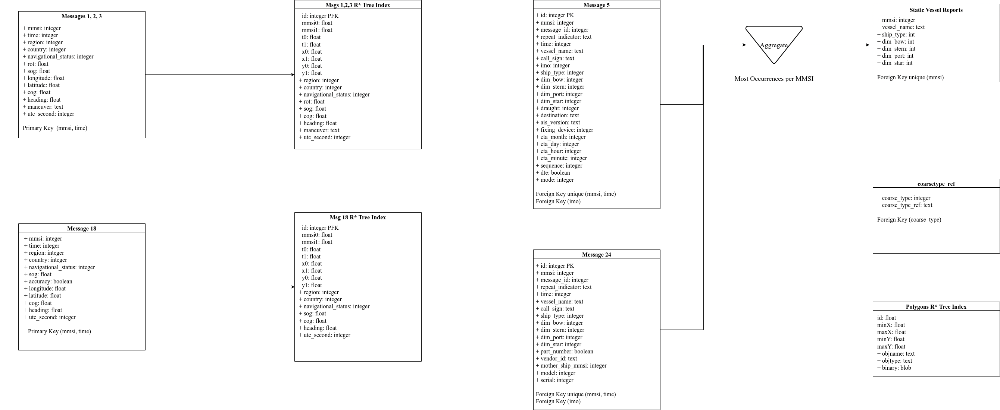

## SQL Database

#### Table Naming

When loading data into the database, messages will be sorted into SQL tables determined by the message type and month. 
The names of these tables follow the following format, where `{month}` indicates the table month in the format YYYYMM

``` SQL
ais_{month}_msg_1_2_3
ais_{month}_msg_18
ais_{month}_msg_5
ais_{month}_msg_24
static_{month}_aggregate
```

Virtual tables will also be created from the position reports tables using INSERT triggers.
These tables are effectively a covering index, but can be queried as if it were a normal table.
For more info, see [SQLite R\* Tree Indexes](https://sqlite.org/rtree.html)  

``` SQL
rtree_{month}_msg_1_2_3
rtree_{month}_msg_18
```

Additional tables are also included for storing data not directly derived from AIS message reports.

``` SQL
rtree_polygons 
coarsetype_ref
hashmap
```


#### Manually writing SQL queries

Instead of using the included run_qry and gen_qry functions for querying the database, SQL code can be written manually. 
As messages are separated into tables by message type and month, queries spanning multiple message types or multiple months should use UNIONs and JOINs to combine results as is appropriate.  

For AIS position reports, the R\* tree virtual tables should be queried instead of the default tables. 
Query performance can be significantly improved using the R\* tree index when restricting output to a narrow range of MMSIs, timestamps, longitudes, and latitudes, although querying a wide range will not yield much benefit. 
If custom indexes are required for specific manual queries, these should be defined on message tables 1_2_3, 5, 18, and 24 directly instead of upon the virtual tables.    

Timestamps are stored as epoch-minutes in the database.
For convenience, import the `dt_2_epoch` and `epoch_2_dt` functions for conversion between datetime format when querying the database manually.    


#### Schema 

See [create_tables.py](../ais/database/create_tables.py) to see the SQL code used to create the database tables. This is represented approximately in the below diagram



